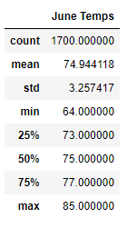
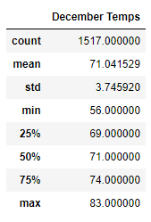
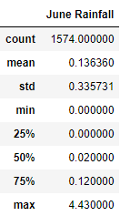
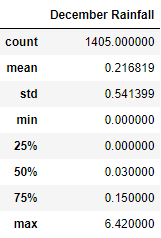

# Surfing with Ice Cream
---
## Overview
---

W. Avy is ready to invest in a surf shack and ice cream parlor in Oahu, Hawaii. To be sure of his investment, he enlisted me to analyze weather data before he made his final decision. I utilized SQLite, SQLAlchemy, and Flask to conduct my research as well as present it to W. Avy and his investment partners. I focused on the months of June and December. 
 

## Results
---
- ### Maximum Temperatures  
    June showed a maximum temperature of 85 degrees Fahrenheit. December has reached 83 degrees Fahrenheit in the past, but is much less likely than it happening in June.   
- ### Minimum Temperatures  
    Analysis of June showed a minimum temp of 64 degrees, while December displayed a minimum temp of 56 degrees. Much larger difference than in the max temps.   
- ### Average Temperatures  
    June averages around 75 degrees in Oahu, HI. December month has average temperatures around 71 degrees.   

       
    *Table 1: Statistics of both June and December months using data collected over several years.*   

## Summary
---
June and December months showed promise for W. Avy's investment. The weather stays rather mild. To add to this point, I continued my analysis by looking at precipitation statistics for those months as well. Please see *Table 2* below. December gets slightly more rain than June, but neither month has shown substantial downpours over the years.   

   
*Table 2: Statistics for precipitation in months of June and December over several years for Oahu, Hawaii.*
